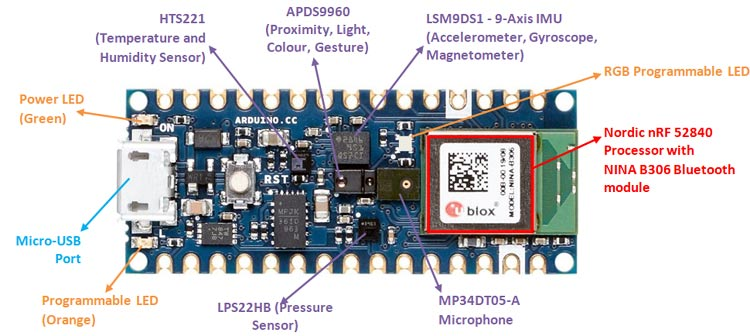
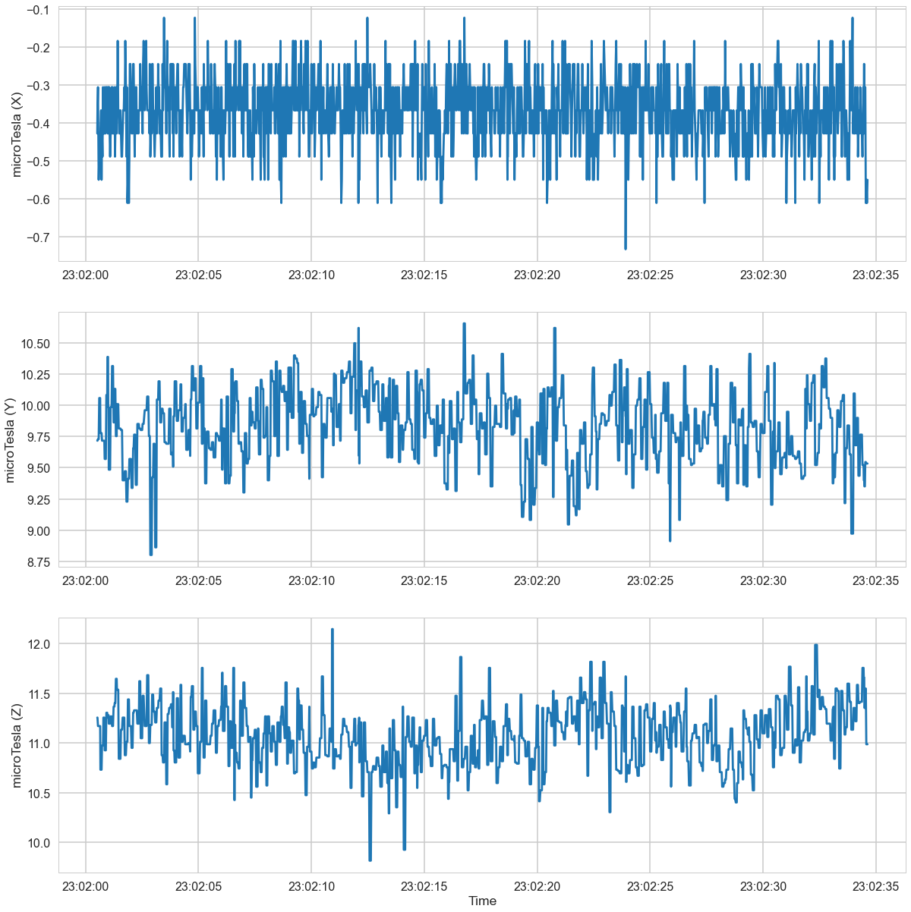

# magnetic-field-classifier
Time series classification model trained on magnetometer data

Arduino Nano 33 BLE Sense, the 3-axis magnetometer sensor of the LSM9DS1 module (IMU sensor). 

The Arduino Nano 33 BLE Sense is a microcontroller board based on the Nordic nRF52840 Bluetooth SoC (System on a Chip). The board measures 45 x 18 mm and has a compact form factor, making it ideal for small-sized projects. The board features a 32-bit ARM Cortex-M4F processor, running at 64 MHz, with 1MB of flash memory and 256KB of SRAM.

The Arduino Nano 33 BLE Sense is equipped with a variety of sensors, including a 9-axis IMU (Inertial Measurement Unit) with accelerometer, gyroscope, and magnetometer, as well as a pressure sensor, a temperature sensor, and a humidity sensor. These sensors allow for the measurement of motion, orientation, atmospheric pressure, temperature, and humidity, making it well-suited for projects that require environmental sensing.

In addition to the sensors, the board also features Bluetooth Low Energy (BLE) connectivity, which allows it to communicate with other BLE devices such as smartphones, tablets, and computers. This feature makes it suitable for projects that require wireless communication.

The board is compatible with the Arduino Integrated Development Environment (IDE), which simplifies the development process for beginners and allows for advanced users to customize the board's functionality. It also includes pre-built libraries that provide access to the sensors and BLE connectivity, making it easier to get started with the board.

The Arduino Nano 33 BLE Sense is a versatile microcontroller board with built-in sensors and wireless connectivity, making it an excellent choice for projects that require environmental sensing and wireless communication.

Magnetometer sensors are electronic devices that are used to measure the strength and direction of magnetic fields. They are based on the principles of electromagnetic induction, which involves the interaction between a magnetic field and an electrical conductor.

Magnetometer sensors can be classified into two main types: scalar magnetometers and vector magnetometers.

Scalar magnetometers measure only the strength of the magnetic field, whereas vector magnetometers measure both the strength and direction of the magnetic field. Scalar magnetometers are simpler and less expensive, but they have limited application compared to vector magnetometers.

Vector magnetometers can be further classified into two types: fluxgate magnetometers and proton precession magnetometers.

Fluxgate magnetometers use a core of ferromagnetic material that is magnetized by an AC current. The core is then subjected to an external magnetic field, which causes a change in the core's magnetization. The change in magnetization is detected by a coil, which produces an output signal that is proportional to the strength and direction of the external magnetic field.

Proton precession magnetometers use the precession of protons in a magnetic field to measure the field's strength and direction. A sample of hydrogen gas is placed in a magnetic field, and the protons in the gas align themselves with the field. A radio frequency pulse is then used to excite the protons, causing them to precess around the magnetic field. The precession frequency is directly proportional to the strength of the magnetic field, and the precession direction indicates the field's orientation.

Magnetometer sensors have a wide range of applications, including navigation, geophysics, and space exploration. They are used in compasses, GPS receivers, and spacecraft guidance systems. They are also used in medical applications, such as MRI machines, where they help generate detailed images of the body's internal structures.

The LSM9DS1 module on the Arduino Nano 33 BLE Sense includes a magnetometer that measures the strength and direction of magnetic fields in three dimensions. The magnetometer is based on the Hall effect, which involves the interaction between a magnetic field and a current-carrying conductor.

The magnetometer on the LSM9DS1 module is a 3-axis sensor, which means it can measure magnetic fields along the X, Y, and Z axes. It has a full-scale range of ±4/±8/±12/±16 gauss, which refers to the maximum magnetic field that the sensor can measure without saturating. The sensor also has a resolution of 0.14/0.29/0.43/0.58 gauss per LSB (least significant bit), depending on the selected full-scale range.

The LSM9DS1 module includes a built-in magnetic field calibration algorithm, which helps to compensate for any errors in the sensor's readings due to external magnetic fields. The calibration algorithm is performed by rotating the sensor in a figure-eight pattern, which allows the sensor to sample the Earth's magnetic field in all three dimensions.

The magnetometer on the LSM9DS1 module communicates with the microcontroller on the Arduino Nano 33 BLE Sense via an I2C interface. The sensor is accessed using the Adafruit_LSM9DS1 library, which provides functions for configuring the sensor's settings, reading the sensor's data, and performing the calibration algorithm.

The magnetometer on the LSM9DS1 module of the Arduino Nano 33 BLE Sense is a 3-axis sensor that measures magnetic fields in three dimensions. It has a full-scale range of ±4/±8/±12/±16 gauss and a resolution of 0.14/0.29/0.43/0.58 gauss per LSB. The sensor includes a built-in calibration algorithm that compensates for external magnetic fields, and it communicates with the microcontroller using an I2C interface.

